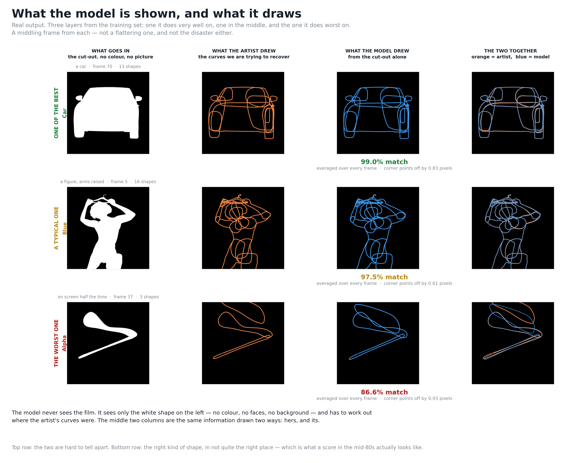

# S0 — the first real attempt

*This is the one that matters most to understand, because everything after it is a variation.*

---

## The thing you spotted, first

You asked: *the model should give us the control points — but control points only exist on
keyframes, not on every frame. So what happens on all the other frames?*

That's the right question, and the answer is the shape of the whole system.

**There are two machines, and only one of them learns.**

**Machine 1 — the drawer.** Looks at one frame, draws the outlines. It does this for **every
single frame**. It has no idea keyframes exist and is never asked about them. If a shot is 56
frames long, it draws 56 times.

**Machine 2 — the editor.** Takes all 56 of those drawings and decides which frames are worth
*keeping* as keyframes, throwing the rest away. It's a fixed rule, not something that learns.

So the model draws every frame; the second machine says *"you only need 21 of these — the software
can work out the rest by itself."*

That's why you'll hear us say "the drawing is nearly solved but the timing isn't." They're
different machines. We measure them separately. And S1, the next chapter, was an attempt to make
machine 2 smarter.

---

## What goes in

Three things, for each frame:

**1. The cut-out.** A black-and-white picture. White where the thing is, black where it isn't.
That's all. No colour, no faces, no background, no film.

**2. The two neighbouring frames.** The frame before and the frame after, lined up on top of the
current one. This is so it can tell which way things are moving — a single still picture can't
show motion.

**3. A name tag.** Something like *"you are drawing shape number 7 of the girl's arm."* The model
keeps a private note for each shape it's ever been shown, and this tells it which note to look at.

That third one is important and slightly uncomfortable: **it means the model is allowed to
remember each specific shape.** It isn't working purely from what it sees. That's deliberate for
now — we're removing that crutch in stages — but it's why the two hidden shots matter so much.

## What comes out

**The corner points of each outline**, for that frame. Numbers — where each corner sits.

That's it. It doesn't produce a picture. It produces the positions of the points an artist would
have dragged around.

---

## How it learns

This is the part people imagine is mysterious. It isn't.

**Step 1 — guess.** At the start the model's points are essentially random. Its first drawings are
about **83 pixels** away from the artist's. Nonsense.

**Step 2 — measure how wrong.** We compare its points to the artist's points and measure the
distance in pixels. That single number is the "how wrong was that" score.

It's not only distance, though. Four things are measured and added together:

| what's measured | in plain terms |
|---|---|
| point distance | how far each corner is from where it should be |
| curve shape | whether the *line between* the corners follows the right path |
| steadiness | whether it wobbles frame to frame when it shouldn't |
| overall movement | whether the whole shape is drifting the right way across the shot |

The middle two matter more than they sound. You can have every corner roughly right and still
produce a curve that bulges wrongly between them. And you can be right on every individual frame
while jittering horribly in motion — which an artist would reject instantly.

**Step 3 — nudge.** The model has about three million internal settings. The maths tells us, for
each one, which direction to move it to make the score slightly better. So we move all of them, a
tiny amount.

**Step 4 — repeat 40,000 times.**

That's the whole loop. Guess, measure, nudge, repeat. Nobody tells it *how* to draw a car. It
finds out by being wrong 40,000 times in a row and being corrected each time.

It takes **22 minutes**.

---

## What "wrong" means here — one thing worth knowing

The artist's keyframes are used **only to mark the answers**. They're never shown to the model as
an input. The model doesn't get to peek at where the artist put her points and then "predict"
them — it draws from the cut-out alone, and only afterwards do we compare.

That sounds obvious. It's a rule we have to actively enforce, because it's easy to accidentally
let the answer leak into the question and end up with a system that scores brilliantly and can't
do anything.

---

## What we got

After 40,000 rounds, twice over (we run it twice with different starting randomness, to check the
result isn't a fluke):

| | |
|---|---|
| **how much of the picture matches** | **97.2%** |
| how far its corners sit from the artist's | **0.83 pixels** |
| worst layer of the seventeen | 86.4% |
| best layer | 99.97% |
| keyframes placed, vs the artist | about the same number |

**0.83 pixels** is the headline. On a 4K frame, that's less than the width of a hair. For most
layers, you cannot tell its drawing from hers by looking.

### But we set seven targets and only four are met

| target | where we are | |
|---|---|---|
| picture matches ≥ 97% | 97.2% | ✅ |
| **every** layer ≥ 90% | worst is 86.4% | ❌ |
| corners within 1.2 pixels | 0.83 | ✅ |
| worst corners within 3 pixels | 2.5 | ✅ |
| sensible number of keyframes | yes | ✅ |
| almost no bad frames per layer | too many on the hard layers | ❌ |
| works as well on unseen frames | very slightly worse | ❌ |

The three misses are all the same story told three ways: **the average is good, and a handful of
layers are not.**

### What failure actually looks like

Look at the bottom row of the picture at the top of this page.

It has **not** drawn nonsense. It's drawn a shape of roughly the right kind and roughly the right
size — and **put it in the wrong place**.

That's the useful distinction. It isn't confused about what it's looking at. It's imprecise about
where. The layers where this happens are small, fast-moving, or on screen only half the time.

---

## One number that was wrong, and how we caught it

Our first score was **95.8%**. The real one is 97.2%. The difference is a mistake worth
describing, because it's the kind that flatters you.

**18% of the frames we were scoring have nothing on them.** The layer is off screen. The artist
drew nothing; the model drew nothing; we scored it 100% — "correctly drew nothing."

Defensible for one frame. Nonsense as an average, because it hands out free marks in proportion to
how often a layer is *absent*. One layer was off screen on 23 of its 42 frames and was getting a
score it hadn't earned on more than half of them.

Once we only counted frames where something is actually on screen, the worst layer dropped from
**84.3% to 66.0%.** The average barely moved. The *floor* moved enormously — and the floor is what
we care about.

We now report both, with the honest one first.

---

## Then we changed three settings and got a lot for free

Remember machine 2, the editor that picks keyframes? It has dials, and nobody had touched them.

Three changes — a different smoothing method, a tighter threshold — and **no retraining at all**:

| | before | after |
|---|---|---|
| picture matches | 94.8% | **97.2%** |
| worst layer | 66.0% | **86.4%** |
| bad frames | 149 | **39** |
| keyframes vs the artist | 0.34× (far too few) | **1.12×** (about right) |

37 seconds of re-scoring. Every one of the seventeen layers improved. Targets met went from two to
four.

The one thing that got *worse*: the gap between how it scores on frames it practised on versus
frames it hadn't. That went from 0.3% to 1.0%. We took the trade knowingly and wrote it down,
because six things improved and the seventh was already failing.

---

## And one thing we nearly got wrong

That change made the keyframe *timing* score jump from 0.42 to 0.75, which looked like a triumph.

It wasn't. Placing more keyframes makes that score easier — some land in the right place by luck.
So we checked: **how well would the same number of keyframes, thrown down at random, have scored?**

| | score | random would get | genuinely earned |
|---|---|---|---|
| before | 0.42 | 0.37 | **0.05** |
| after | 0.75 | 0.68 | **0.07** |

The score rose by 0.33. Random guessing rose by 0.31 of it.

**We'd bought almost all of it by placing three times more keyframes, not by placing them better.**

That finding is what S1 is about — and it's why we checked the next stage's target before
building anything for it.

---

## Where S0 left us

**The drawing is close to solved.** Sub-pixel accuracy, a picture you can't tell from the
artist's on most layers.

**Two things remain.** A handful of hard layers where shapes land in the wrong place. And keyframe
timing, which is barely better than chance once you account for how many keys get placed.

Next: [s1.md](s1.md).
