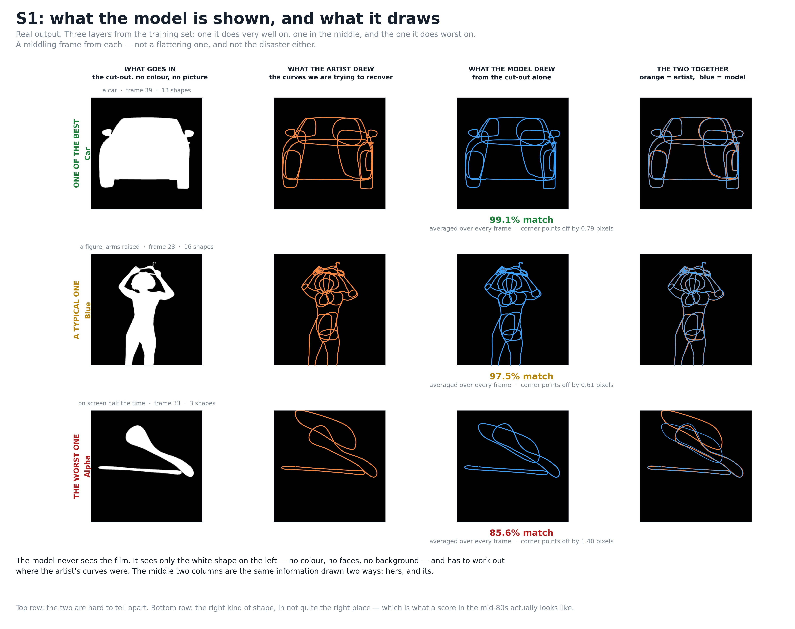

# S1 — teaching it *when* to place a keyframe

*Read [s0.md](s0.md) first. This only makes sense after the two-machines bit.*

---

## What we were trying to fix

Machine 2 — the editor that decides which frames become keyframes — is a fixed rule. It works like
this: *walk along the shape's movement, and spend a keyframe whenever a straight line would drift
too far from the real path.*

That's an accounting rule. It knows nothing about animation. It doesn't know that artists key the
moment a hand changes direction, the moment a foot lands, the moment something stops.

**S1 was an attempt to give it that sense.** Teach a component to predict "this frame matters",
and let it nudge the rule.

## How it was allowed to work

Important design choice: the new component is **never allowed to place a keyframe itself.**

All it can do is whisper to the existing rule — *"this frame looks important, be more willing to
spend a key here"*, and *"this stretch looks dull, feel free to skip further"*.

Why the restriction? Because this project's characteristic failure is placing **too many**
keyframes, and a system that can only whisper can't cause that. The old rule still has to pay for
every keyframe it places, so it stays economical no matter what it's told.

---

## What we found before writing any code

Every stage has a pass mark agreed in advance. S1's was: **a keyframe-timing score of 0.50 or
better, while placing a sensible number of keys.**

We checked whether that pass mark was any good. It wasn't. **We passed it twice without building
anything.**

**Once by turning a dial.** Those three settings from the end of S0 — no learning involved — got
**0.75**. Comfortably past 0.50.

**Once with a rule a child could write.** "Put a keyframe on every single frame" scores **0.58**
across our seventeen layers. Also past 0.50. With no model at all.

### How can that possibly work?

Because on many of these layers, the artist nearly does that.

Keyframe density across our seventeen layers ranges **48×**:

- one layer is keyed on **1.9%** of its frames
- another is keyed on **90.6%**

On a layer that's keyed 90% of the time, firing constantly catches nearly every keyframe. Average
that across layers and the dumb rule clears the bar.

**So the pass mark was measuring how often artists key, not whether we key in the right places.**

We proposed changing it to *"how much better than the dumb rules are you?"* — and set the new bar
at 0.15, roughly double what we already got for free.

---

## Then we ran it

45 minutes. Two runs, to check nothing was a fluke.

| | better than guessing |
|---|---|
| before, no learning | 0.072 |
| **after, with learning** | **0.091** |
| what we'd said we needed | **0.150** |

**It helped. Not enough.** The improvement is real — both runs agree, and the gap between them is
tiny. But it's about a quarter of the way to what we'd decided was worth having.

### The result that settles it

We also scored the new component **on its own**, separate from everything else.

**It scored worse than the dumb rule.** Worse than "put a keyframe on every frame."

So it hasn't learned to recognise keyframes. It's picked up something faintly useful as a nudge,
and that's the whole of it.

---

## Why we stopped instead of tuning

We wrote the stopping rule down **before** running anything:

> If it doesn't beat the dumb rules, report that and move on. Don't tune until it passes.

That sentence exists because the alternative is very tempting and very easy. There are always more
settings to try, and with enough attempts you will eventually find a combination where the number
looks good — and you'll have learned nothing except which combination flatters you.

It didn't beat the dumb rules. So we move on.

---

## Two pieces of good news

**It broke nothing.** Picture quality is identical — 97.17% before, 97.12% after, which is inside
normal run-to-run wobble. Adding the new component didn't cost us anything elsewhere.

**Keyframe counts got slightly better.** We now place about 1.04 keyframes for every 1 the artist
places. Before it was 1.12. Closer to right.

---

## What this cost, and what it bought

**Cost:** 45 minutes of training and an afternoon. No new data, no bigger computer. Almost none of
the code was new — the component had been built earlier and was sitting switched off.

**Bought:** we now know that keyframe *timing* is genuinely hard, and not solvable by the approach
we had lined up. We also know the pass mark we'd written for it was measuring the wrong thing,
which would have quietly misled us later.

That's a real answer to a real question, for an afternoon.

---

## Where this leaves us

**Drawing shapes: close to solved.** Sub-pixel accuracy.

**Placing keyframes at the right moments: not solved, and now known to be hard.** Barely better
than chance, and our first attempt at fixing it moved the needle by a quarter of what we wanted.

**Next up is a different problem entirely** — currently we *tell* the model how many shapes a layer
has and which is which. The next stage takes that away and makes it work that out too. That's a
bigger ask than keyframe timing, and it's the direction the whole project is heading: removing
what we hand it, one thing at a time.
