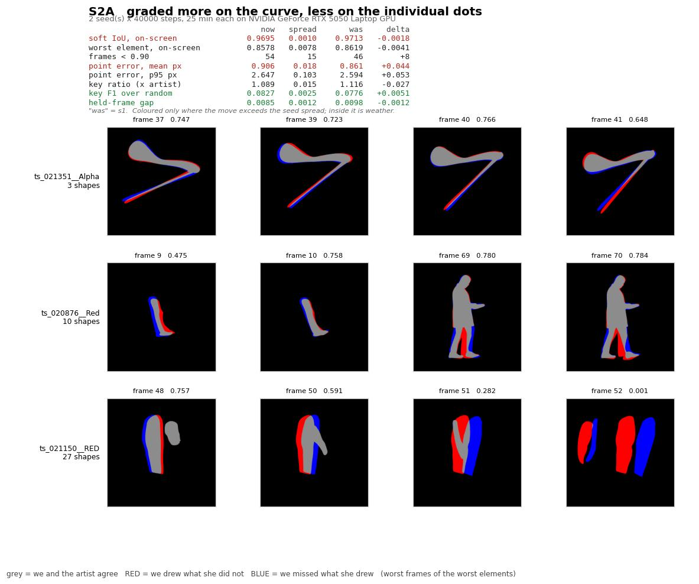
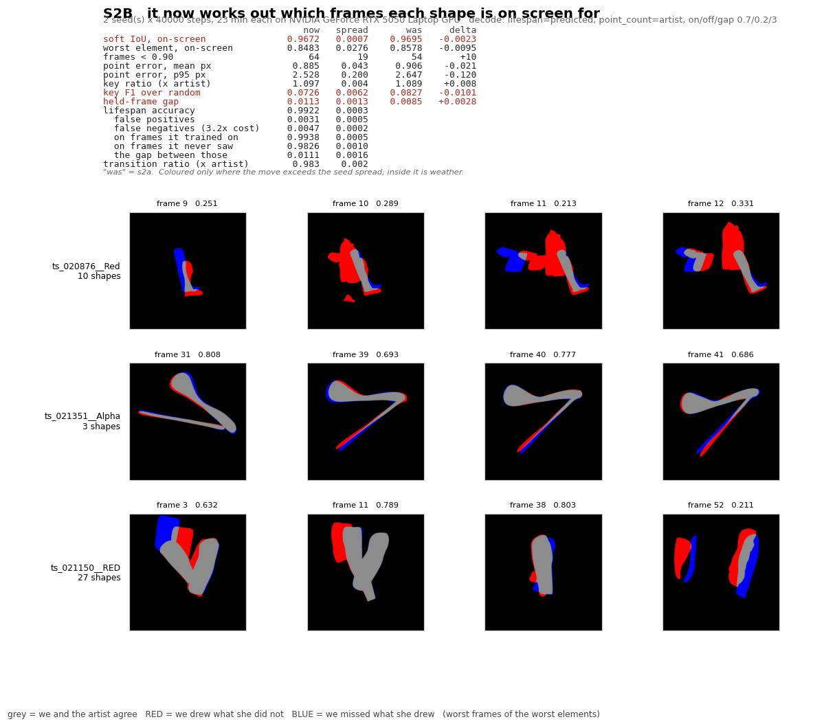
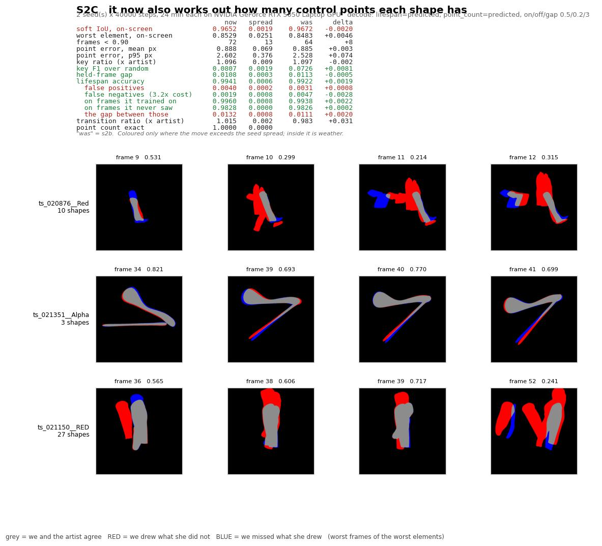

# S2 — the attempt log

*Every training attempt, what it cost, what it bought, and whether it was a plan or a retry.*

This file exists so the time is accountable. Training something, looking at it, changing one
thing and training it again is the normal way this work goes — but a record that only keeps the
attempts that worked cannot justify the ones that did not. So **every** attempt gets an entry
here, in order, whether it was on the plan or a reaction to something looking wrong.

Each entry has a picture: `s2-attempt-<name>.jpg`. In those pictures, **grey** is where we and
the artist agree, **red** is where we drew something she did not, and **blue** is where we
missed something she drew. Red and blue are the two mistakes this whole stage is about, and
they do not cost the same — blue is about three times worse, for reasons in
[s2.md](s2.md).

**Read [s2.md](s2.md) first** for what S2 is trying to do. This file is the diary.

---

## Running total

| | |
|---|---|
| attempts so far | **3 done. S2 complete.** |
| GPU time spent | **2 h 30 min** (S2A 55, S2B 47, S2C 48) |
| analysis time on top | ~40 min of scoring, sweeps and pictures |
| **retries so far** | **0** — every attempt was on the plan, none had to be redone |

*A "retry" is an attempt made because a previous one looked wrong, as opposed to a rung that was
on the plan from the start. Retries are the number this log exists to make visible.*

**A caveat on the timings above.** S2A's two seeds took 25 and 30 minutes for identical work.
The difference is not the model — it is that scoring the previous attempt was running on the
same machine during the second seed. The same applies to any run where analysis overlapped
training. Treat the minutes here as *what it cost us in wall time*, which is the honest thing
for justifying an afternoon, and not as a measurement of how fast the model trains.

---

## Before any training: what we measured instead

**Cost: one afternoon, no GPU.**

We did not start by training. S1 — the stage before this one — was closed by a discovery that
could have been made before its run: its pass mark could be cleared by a rule a child could
write. So S2 began by pricing its own pass mark.

The finding was worth the time twice over:

- **The pass mark is sound.** Every trivial answer costs eight to eleven times the whole
  budget. Unlike S1, you cannot clear this one by doing nothing.
- **The pass mark may be too tight.** Being one frame early or late on *every* appearance and
  disappearance costs the entire budget, or 3.7× it. A component could work close to as
  designed and still fail.

That second point was put to you as a decision rather than settled by us, and the answer was
**keep the 0.01 and expect a reported failure**. So a failure here is a planned outcome, not a
surprise — which is exactly what makes it cheap.

Full detail: [../v2-s2-design-note.md](../v2-s2-design-note.md) and
[../steps/s2-design-faq.md](../steps/s2-design-faq.md).

---

## Attempt 1 — S2A: change the marking scheme, nothing else

**Status: done, two seeds. Cost: 55 min. Verdict: PASSED — carry the change forward.**



**What changed.** Nothing about the model's shape. One thing about how it is marked: the plan
says that as the model starts inventing structure, we should grade it more on *the curve it
draws* and less on *whether each individual dot landed where the artist's dot was*. So the dot
term was turned down 4× and the curve term turned up 2×.

**Why do this alone.** Because it is the one change in S2 that can only *cost* us at this stage.
The model is still told which shape is which, so matching dots one-for-one is still a fair
question — the re-weighting is preparation for a later stage. If it damages the drawing, we want
to know that by itself, and not discover it mixed in with two brand-new components where nothing
would say which was to blame.

**What happened.** The picture did not measurably change, and four other things quietly got
better.

| | before (S1) | after (S2A) | is the move real? |
|---|---|---|---|
| **picture quality** | 0.9713 | 0.9695 | **no** — smaller than run-to-run wobble |
| dot precision | 0.861 px | 0.906 px | **yes, worse** |
| wobble between frames | 0.726 | 0.676 | yes, better |
| keyframe timing skill | 0.0776 | 0.0827 | yes, better |
| gap to unseen frames | 0.0098 | 0.0085 | yes, better |

Both attempts were run twice, and the difference between the two runs of the *same* attempt is
0.0022 — larger than the 0.0018 the picture quality moved. So the picture change is weather, not
a result. That is why it is not coloured in the card.

**The dots did get less precise, and that is the change working rather than failing.** We
explicitly told it to care less about landing each dot exactly where the artist's dot was. It
cared less, by about a twentieth of a pixel. What it was told to care about instead — the
resulting curve, which is what gets rendered — did not suffer.

**A stopping rule was written before this ran:** if the change cost more than run-to-run wobble
on the picture, revert to the old marking scheme for the next two attempts. It cost less. So the
change stays, and attempts 2 and 3 carry it.

**One thing worth flagging in the picture.** Bottom row, last frame: the shapes are drawn in
completely the wrong place — red and blue side by side with almost no grey. That is
`ts_021150__RED`, the element that is on screen only 9% of the time, and it was failing that way
before this attempt too. It is not something S2A caused, and it is not a lifespan problem. It is
on the list.

**Honest note.** Quadrupling the curve term's weight left the curve measurement itself unchanged
(0.275 both times). If multiplying a term by four does not move it, that term and the dot term
are largely measuring the same thing at this stage. Worth knowing later; not worth acting on now.

---

## Attempt 2 — S2B: the lifespan component

**Status: done, two seeds. Cost: 47 min. Verdict: PASSES the pass mark.**



**What changed.** The model is no longer told which frames each shape is on screen for. It works
it out from the picture, and the answer is written into the file it produces.

**What happened. It passed, and by more room than we expected.**

The pass mark was: the picture must stay within 0.01 of where S1 left it. S1 was at 0.9713. This
came in at **0.9672** — a drop of 0.0041, less than half the budget. **With two of the three
cheat-sheet lines now gone, the picture is essentially where it was.**

| | |
|---|---|
| how often it gets a shape's on/off state right | **99.22%** |
| ...on frames it trained on | 99.38% |
| ...**on frames it had never seen** | **98.26%** |
| number of appearances/disappearances it invents | **0.98×** the artist's |

The "never seen" line is the one that matters, and it is why the middle row of that table is
there. Guessing "every shape is always on screen" would score 62.7%. It scores 98.26% on frames
it has never laid eyes on. So it is genuinely reading the picture, not just remembering these
particular frames.

**But we were wrong about something, and it is worth saying plainly.**

Before running this we predicted it would probably fail, and we published the reasoning: the
component would need to be right 99% of the time, and being one frame off at every appearance
would blow the budget on its own.

Then we measured something we had only asserted: **how much of a shape's appearance is even
visible.** Because the cutout is a union of overlapping shapes, a shape switching off inside a
pile changes no pixels at all. It turns out **61% of all appearances and disappearances in this
data are invisible** — you could not see them if you tried.

That sounds like bad news and is mostly the opposite. A shape you cannot see is one you cannot
get *wrong* either. Our failure prediction came from a test that spread mistakes evenly across
all shapes; a real component makes its mistakes exactly where it cannot see, which is exactly
where mistakes are free.

The clearest single example: on `ts_020036__Car`, the component misses **3.1%** of the frames a
shape should be on screen — the worst miss rate in the set — and that element's picture
**got better anyway**. The shapes it dropped were invisible ones.

We have marked that prediction as withdrawn in the design note rather than quietly deleting it.

**The cost, and it is one element.** The 0.0041 drop is almost entirely a single layer:

| | picture before | after | change |
|---|---|---|---|
| `ts_020876__Red` | 0.8804 | 0.8345 | **−0.046** |
| `ts_021658__Layer_4` | 0.9499 | 0.9401 | −0.010 |
| *the other 15* | | | between −0.001 and **+0.013** |

**Thirteen of seventeen layers got no worse or better.** `ts_020876__Red` is the top row of the
card, and you can see the problem directly: big red blobs where the component has switched shapes
*on* that should be off. Its false-positive rate is 1.4%, four times the average.

**What actually got worse, honestly.** Two things moved beyond run-to-run wobble in the wrong
direction: keyframe timing skill slipped (0.083 → 0.073) and the gap between frames it trained on
and frames it did not widened (0.0085 → 0.0113). The second is the one to keep an eye on — it
means some of this performance is memory of the training frames rather than understanding.

**Something we predicted that did not happen, in the other direction.** We expected the decoding
settings — how eager the component is to switch a shape on versus off — to be most of whether
this passed, and built a 16-setting sweep for it. Every one of the 16 landed between 0.9509 and
0.9540. The settings barely matter. We were wrong about where the difficulty was.

---

## Attempt 3 — S2C: the point-count component

**Status: done, two seeds. Cost: 48 min. Verdict: PASSES the pass mark — and confirms, exactly,
the thing we predicted would go wrong with it.**



**What changed.** On top of S2B, the model also stops being told how many control points each
shape has — and that number is removed from what it is shown.

**The picture held.** 0.9652 against S1's 0.9713 — a drop of 0.0061, inside the 0.01 budget.
**All three cheat-sheet lines that S2 set out to remove are gone, and the picture is where it
was.**

**We called the point-count problem correctly, and here is the proof.**

Before building it we said: the model still knows *which shape is which*, and a point count never
changes over time, so it will simply memorise the answer rather than read it from the picture. We
said we would report the number and gate nothing on it.

| | gets the point count exactly right |
|---|---|
| on layers it trained on | **100.0%** |
| **on shots it has never seen** (no memory to look in) | **5.0%** |
| for comparison: always guessing the commonest value | 7.7% |

With its memory it is perfect. Without it, it does **worse than always guessing "16"**. It
learned nothing about reading point counts off a picture — exactly as predicted, before a line of
it was written.

That is not a failure of the attempt. It is the attempt doing its job: the component exists, it
is debugged, and we know precisely what it is worth. The honest version of this test needs the
next stage, where shape identity goes away too.

*(One caveat on that 5%: an unseen shot also has no memory for the shape's* position*, so the
whole model is broken there — the picture quality is 0.04. It is a floor, not a clean isolation
of the point-count component. We are not claiming more from it than that.)*

**A bonus we did not expect.** Taking the point count out of what the model is shown did not
hurt the lifespan component — it came in slightly *better* than S2B: 99.41% against 99.22%. And
the keyframe timing skill that S2B lost came back (0.073 → 0.081).

---

# S2 verdict

**All three rungs passed. Two of the three things we used to tell the model, it now works out.**

| | S1 (before) | S2 (after) | budget |
|---|---|---|---|
| picture quality | 0.9713 | **0.9652** | −0.01 allowed |

**Cost: 2½ hours of computer time, no retries, no new data, no bigger machine.**

**What we got right before running anything:** that the pass mark was sound and could not be
cleared by doing nothing; that the point-count component would memorise rather than learn.

**What we got wrong, and corrected in public:** we predicted the lifespan component would fail,
from a calculation that assumed its mistakes would be spread evenly. They are not — they land on
the 61% of appearances that are invisible in the picture, which are the same ones that cost
nothing to get wrong. We also expected the decode settings to be most of the difficulty; all 16
settings we tried landed within 0.003 of each other.

**What to watch.** The gap between frames it trained on and frames it has never seen widened
across the stage (0.0085 → 0.0108). Some of this performance is memory rather than understanding.

**That bill came due immediately, and it is now measured.** S3 removes the memory, and the same
gap collapses to 0.0027 — confirming it *was* memory. The S3 diary is
[s3-attempts.md](s3-attempts.md); it is kept separate because S3 asks a different question and
its numbers are read against a different baseline.

---

## How to add an entry

```bash
PY=/home/aman/.pyenv/shims/python3
PYTHONPATH=src $PY scripts/score_v2.py s2b                    # the numbers
PYTHONPATH=src $PY scripts/fig_s2_attempt.py --run s2b --against s2a \
    --change "the lifespan component" --lifespan predicted    # the picture
```

Then write the entry: what changed, why, what happened, verdict. **Retries get an entry too**,
with the reason the previous attempt looked wrong stated plainly.

**S2 is closed.** New attempts go in [s3-attempts.md](s3-attempts.md).
