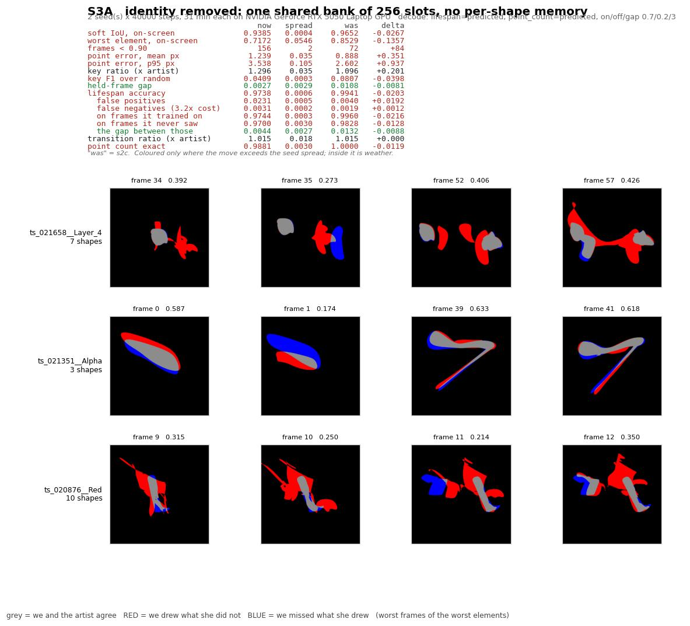
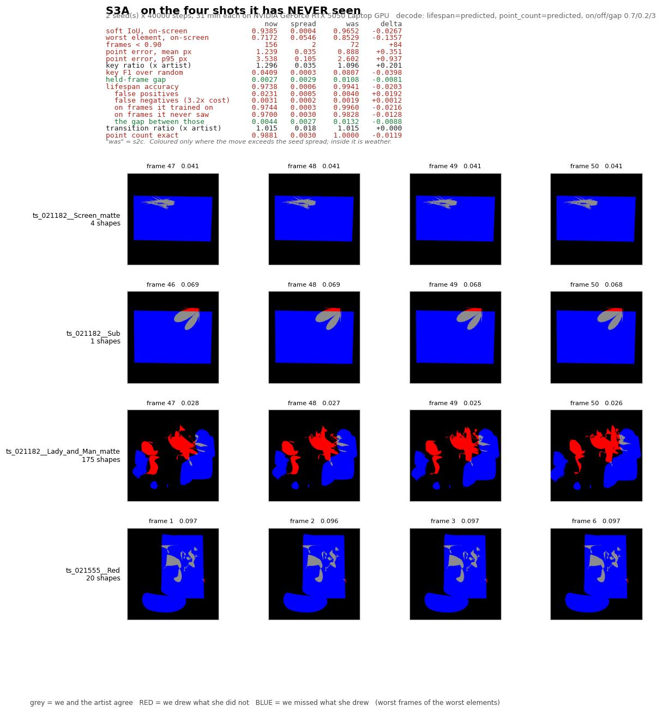

# S3 — the attempt log

*Every training attempt at stage S3, what it cost, what it bought, and whether it was a plan or
a retry.*

Split from [s2-attempts.md](s2-attempts.md) because S3 asks a different question. S2 was
*"can it work out two things we used to tell it, without the picture getting worse?"* — a
question about a working system giving something up. S3 is *"can it work at all without being
told which shape is which?"* — and the honest starting point is a system that does not work:
0.0377 picture quality on a shot it has not seen.

So the numbers here are not read against S2's. They are read against **what you get for free**:
tracing the outline of the cutout by hand, no model involved, which scores **0.9697** on the
shots we hold back. That is the thing to beat, and it is why a 0.93 here is not the good news
the same number would have been at S2.

Each entry has pictures: `s3-attempt-<name>.jpg`. **Grey** is where we and the artist agree,
**red** is where we drew something she did not, **blue** is where we missed something she drew.

**Read [s3.md](s3.md) first** for what S3 is trying to do, and
[../v2-s3-design-note.md](../v2-s3-design-note.md) for the engineering version. This file is
the diary.

---

## Running total

| | |
|---|---|
| attempts so far | **1 done** (S3A), 2 planned |
| GPU time spent | **1 h 2 min** |
| analysis time on top | ~30 min of scoring, a sweep and two pictures |
| **retries so far** | **0** |

*A "retry" is an attempt made because a previous one looked wrong, as opposed to a rung that
was on the plan from the start. Retries are the number this log exists to make visible.*

**The timings are honest wall time, not training speed.** Scoring and sweeps ran on the same
machine as training, so a seed's minutes include whatever else was competing for the card.

---

## Before any training: what we measured instead

**Cost: an afternoon, no GPU.**

S3's pass mark was *"the picture must reach 0.95 on layers it has never seen"*. We priced it
before designing anything, the same way we priced S2's.

**It fell.** Take the artist's own cutout, trace its outline, resample it to a sensible number
of control points, rebuild it as real shapes and render it back:

| what we did | shapes it used | score on held-out layers |
|---|---|---|
| trace each blob's outline, 64 points | **1.2** | **0.9697** |

The artist used between 1 and 247 shapes. The trace used 1.2, understands nothing, cannot be
edited the way an artist needs — and clears a 0.95 bar.

So the pass mark was amended before any S3 code was written: **the picture must beat the
traced outline**, and the *style* of the answer — how many shapes, how many points, how many
keyframes — became a hard requirement rather than a nice-to-have. Without that, S3 could pass
by drawing one blob.

Full detail: [../v2-s3-design-note.md](../v2-s3-design-note.md) §3.

---

## Attempt 1 — S3A: the last line off the cheat sheet

**Status: done, two seeds. Cost: 1 h 2 min. Verdict: the mechanism works and DOES NOT PASS.
The stop condition did not fire, so the stage stays open — but the reason it fails is not the
one the remaining attempts were designed to fix.**





**What changed, and why it is a much bigger change than it sounds.**

Until now the model has kept a private notebook: one memory slot per shape, per layer. Slot
#7 of `ts_020876__Red` means *that* shape and nothing else. It is how the model knows which
shape it is drawing.

S3A takes the notebook away. There is now **one shared set of 256 blank slots** used for every
layer in the dataset, and nothing in a slot can name a shape. Everything layer-specific has to
be worked out by looking at the picture.

**Why this is the rest of the project, not the next step.**

We can already measure what that notebook was worth. Take the finished S2 model and wipe the
notebook — leave everything else intact:

| | picture quality |
|---|---|
| S2, with its notebook | **0.9652** |
| the same model, notebook wiped | **0.0377** |

**The notebook is carrying about 96% of the result.** Everything S0, S1 and S2 achieved sits on
top of it. S3's entire job is to replace it with something derived from the picture.

So the bar for this attempt is not 0.95. It is: **does 0.0377 move at all?** We wrote the
stopping rule before starting — if it does not move beyond run-to-run noise, we report that and
stop, because the two follow-up attempts would be refinements to a mechanism that does not work.

**A problem this attempt had to solve first: which slot is which?**

With a shared set of slots, something has to decide that layer's third shape goes in slot 3.
It cannot be "third in the artist's file" — that is a fact about how she built the file, not
about what it looks like, and the model has no way to know it.

So shapes are ordered by **which group they move with, then by where their centre sits in the
frame** — both things you could work out by looking. It is a guess about convention, and one of
the three planned attempts is specifically to test it against the alternative.

**One thing that got better immediately, before any training.** With a shared set of slots, the
four held-out shots can finally be **scored properly**. Until now they had no memory slots at
all, so their number measured nothing and was reported separately as a floor. Now the real model
applies to them. That is the first genuine generalisation number this project has had.

**Cost note:** this attempt is slower per step than S2 — 256 slots are processed for every layer
against S2's 1 to 247 — so about 31 minutes a seed rather than 25.

---

### What happened

**On layers it has seen, taking the notebook away costs surprisingly little.**

| | with the notebook (S2C) | without it (S3A) |
|---|---|---|
| picture quality | 0.9652 | **0.9385** |
| dot precision | 0.888 px | 1.239 px |
| gap to frames it never saw | 0.0108 | **0.0027** |

That third row is the cleanest result of the day. Removing the memory *removed the memorising*:
the gap between frames it trained on and frames it did not collapsed by four times. It is no
longer remembering; it is looking.

**On shots it has never seen, it fails almost completely.**

| | |
|---|---|
| picture quality on the four unseen shots | **0.2031** |
| the same number before this attempt | 0.0377 |
| what a silhouette traced by hand scores there | **0.9697** |

The second picture above is what 0.2031 looks like: a small grey scribble where a large blue
region should be. Blue is what it missed. It is drawing almost nothing.

**So: the mechanism works, and it does not generalise.**

We wrote the stopping rule before running: *stop if the 0.0377 floor does not move.* It moved,
5.4×. So by the letter of the rule this stage stays open. But the honest reading is harder than
that number: it is **far below what tracing the outline by hand achieves**, and the two remaining
planned attempts change the *loss* and the *slot-matching* — neither of which is what is broken.

### What the failure actually points at

Two numbers sit side by side and say the same thing:

- gap to unseen **frames** of a shot it knows: **0.0027** — essentially perfect
- quality on a shot it has **never seen**: **0.2031** — near-total failure

It generalises perfectly *within* a shot and not at all *across* shots. That is not the
signature of a broken mechanism. It is the signature of **too few shots** — the model has seen
ten, of which it trains on eight. There is nothing in eight shots from which to learn what
roto shapes look like in general.

### Two style signals also fail, and they are gates now

Under the pass mark you accepted, these are hard requirements rather than nice-to-haves:

- **keyframe economy 1.296×** — scraped inside the [0.75, 1.3] band only after the decode was
  tuned; it was 1.345 before, i.e. outside.
- **point counts on unseen shots: 4.0% exact** — below the 7.7% you would get by always
  guessing "16". Same memorisation story as S2C, now confirmed with the memory slots gone.

### A bug this attempt found, and how

Scoring first reported 0.7998 picture quality and 16.3 px dot error. The training log said
1.09 px. Those cannot both be true, and the training log was right.

With a shared set of slots, "never trained on" and "scored with fake stand-in memory" stopped
being the same fact — and the report was still splitting on the old one, so four untrained
layers were being averaged into the headline. Real number 0.9385, reported as 0.7998.

**It was caught only because two independent measurements disagreed.** There is now a test
pinning the distinction so it cannot come back.

---

## How to add an entry

```bash
PY=/home/aman/.pyenv/shims/python3
export PYTHONPATH=src
$PY scripts/score_v2.py s3b --lifespan predicted --point-count predicted \
    --alive-on 0.7 --alive-off 0.2 --alive-min-gap 3
$PY scripts/fig_s2_attempt.py --run s3b --against s3a --change "..." \
    --lifespan predicted --point-count predicted --out luthra-understands/s3-attempt-s3b.jpg
$PY scripts/fig_s2_attempt.py --run s3b --against s3a --held --elements 4 \
    --change "on the four shots it has NEVER seen" --lifespan predicted \
    --point-count predicted --out luthra-understands/s3-attempt-s3b-unseen.jpg
```

**Two pictures per S3 attempt, not one.** The trained-layer card and the unseen-shot card say
different things at this stage, and only the second one is about generalisation.

Then write the entry: what changed, why, what happened, verdict. **Retries get an entry too**,
with the reason the previous attempt looked wrong stated plainly.
